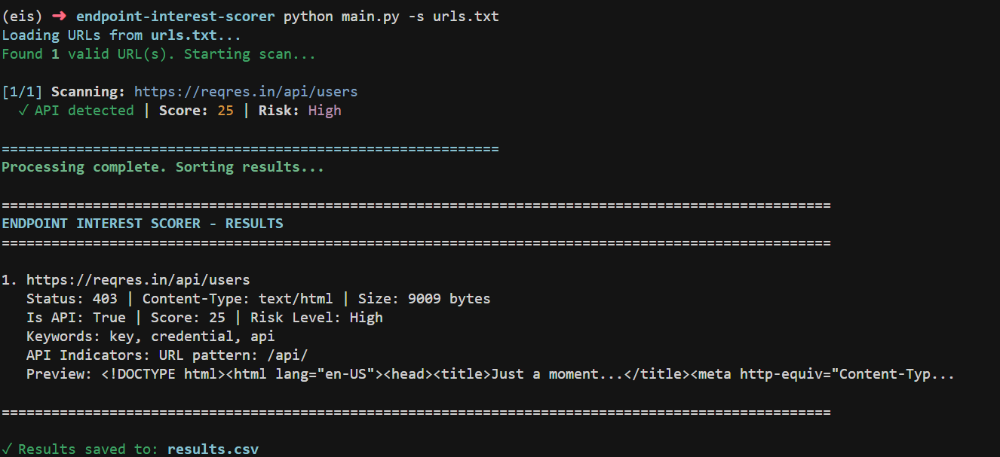

# Endpoint Interest Scorer

A simple Python CLI tool that scans URLs, detects API endpoints, and scores them based on their potential security interest.

## Features

- 🔍 Scans multiple URLs from a text file
- 🌐 Sends HTTP GET requests with timeout protection
- 🔎 Detects API endpoints using multiple indicators
- 📊 Scores endpoints based on status codes, keywords, and parameters
- ⚠️ Assigns risk levels (Low, Medium, High, Very High)
- 📄 Exports results to CSV
- 🖥️ Displays formatted results in terminal

## Installation

1. Install **Python 3.6 or higher** (required for f-string support)
2. Install dependencies:

```bash
pip install -r requirements.txt
```

### Python Version Compatibility

This program requires **Python 3.6+** because it uses:
- f-strings (introduced in Python 3.6)
- `json.JSONDecodeError` (Python 3.5+)
- Modern exception handling

**Tested Python versions:**
- Python 3.6+
- Python 3.7+
- Python 3.8+
- Python 3.9+
- Python 3.10+
- Python 3.11+
- Python 3.12+

To check your Python version:
```bash
python --version
```

## Usage

### Basic Usage

```bash
python main.py urls.txt
```

### Specify Output File

```bash
python main.py urls.txt -o my_results.csv
```

### Input File Format

Create a text file with one URL per line:

```
https://example.com/api/v1/users
https://example.com/admin/login
https://example.com/rest/products
https://example.com/graphql
```
<p align="center">
  
</p>

Comments (lines starting with `#`) and empty lines are ignored.

## How It Works

### 1. Scanning
- Sends HTTP GET requests to each URL
- Collects status code, headers, content type, response size, and body preview
- Handles timeouts and connection errors gracefully

### 2. Detection
An endpoint is detected as an API if it matches any of:
- URL patterns: `/api/`, `/v1/`, `/v2/`, `/v3/`, `/rest/`, `/graphql`
- Content-Type header contains `application/json`
- Response body is valid JSON

### 3. Scoring
Only API endpoints are scored. Points are awarded for:
- **Status 200**: 5 points (successful response)
- **Status 401/403**: 10 points each (authentication/authorization)
- **Status 500**: 15 points (server error)
- **URL Parameters**: 3 points
- **Keywords**: 5 points per match (admin, auth, login, token, debug, config, etc.)

### 4. Risk Levels
- **Low**: Score 0-9
- **Medium**: Score 10-19
- **High**: Score 20-29
- **Very High**: Score 30+

## Output

### Terminal Output
Results are displayed sorted by score (highest first) with:
- URL
- Status code and content type
- API detection status
- Score and risk level
- Matched keywords
- API indicators
- Response preview

### CSV Output
Results are saved to a CSV file with columns:
- url
- status_code
- content_type
- response_size
- is_api
- score
- risk_level
- matched_keywords
- api_indicators
- body_preview

## Project Structure

```
endpoint-interest-scorer/
├── main.py          # Entry point and CLI handling
├── scanner.py       # HTTP request handling
├── detector.py      # API detection logic
├── scorer.py        # Scoring and risk level assignment
├── config.py        # Configuration (weights, keywords, thresholds)
├── utils.py         # Helper functions
├── requirements.txt # Dependencies
└── README.md        # This file
```

## Configuration

Edit `config.py` to customize:
- Score weights for different indicators
- Keywords to search for
- API URL patterns
- Risk level thresholds
- Request timeout settings

## Error Handling

The tool handles:
- Invalid URLs (skipped with warning)
- Connection timeouts
- Connection errors
- HTTP errors
- Invalid JSON responses
- File I/O errors

## Requirements

- **Python 3.6 or higher** (required)
- `requests` library (install via `pip install requests`)
- All other dependencies are from Python standard library

## License

This tool is provided as-is for educational and security research purposes.

